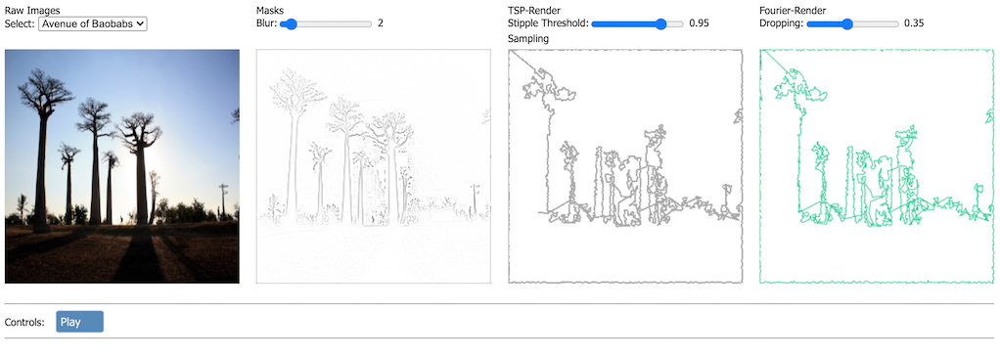

## TSP Fourier
In this demo we perfom image synthesis by convolving the original image and reformulate it as a graph TSP problem, then just for fun, we transform the TSP problem into a Fourier epicycle approximation.

### Process
Given an image we run the following steps
- Apply greyscale transform
- Apply sobel edge detection
- Invert the colour space
- Apply Guassian blur
- Apply dodge effect on grescaled image and blurred image
- Apply stippling effect

At this stage we can think of the stipples as graph nodes
- Run a TSP-solver to create a traversal path
- Run Fourier transform on the path to create periodic epicycles
